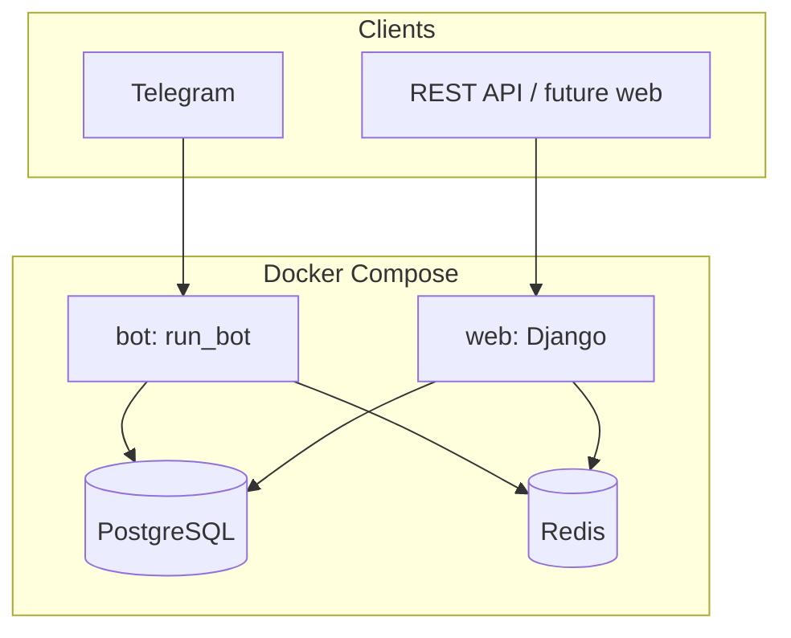
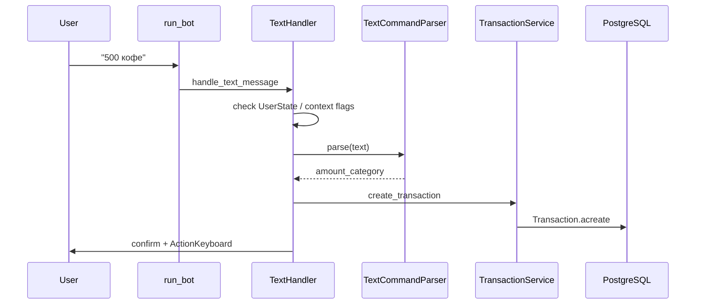
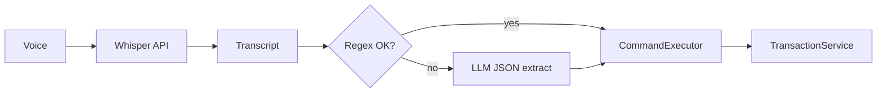

# FinHub — архитектура (agent reference)

## Общая схема



## Telegram: ввод транзакции (текст)



**State machine:** `UserState` + `context.user_data` — editing transaction, goal flow, budget input перехватывают текст до парсера.

## Telegram: handler registration

Файл: `telegram_bot/management/commands/run_bot.py`

| Filter | Handler |
|--------|---------|
| `/start`, `/help`, `/stats` | `CommandHandler` |
| `TEXT & ~COMMAND` | `TextHandler.handle_text_message` |
| all callbacks | `CallbackHandler.handle_callback_query` |
| `VOICE \| AUDIO` | `VoiceHandler.handle_voice_message` |

## Слои telegram_bot

```
telegram_bot/
  handlers/       # UI / routing (thin)
  services/       # business logic, DB
  keyboards/      # InlineKeyboard builders
  utils/          # text_parser, admin_alerts, telegram_resilience
  models.py       # TelegramUser, UserState, BotText
  voice/          # Whisper, interpreter, router
```

**Правило:** handlers вызывают services; не дублировать ORM-логику в handlers.

## Planned: voice pipeline



Детали: [voice-input.md](voice-input.md)

## Django models (связи)

```
User 1--* Category
User 1--* Transaction
User 1--* Budget
User 1--* Goal
Category 1--* Transaction
Category 1--* Budget
Goal 1--* GoalLedgerEntry
TelegramUser 1--1 User
TelegramUser 1--1 UserState
```

## API

- Versioning: `core/middleware.py` → header `X-API-Version`
- Auth: Token (djoser)
- Rate limit: `django-ratelimit` на views (prod)

## Production vs development

| | development | production |
|---|-------------|------------|
| Cache | DummyCache | Redis |
| Rate limit | off | on |
| DEBUG | True | False |
| DB SSL | — | `DB_SSLMODE` env |

## Файлы-«god objects» (осторожно при правках)

| Файл | ~строк | Примечание |
|------|--------|------------|
| `handlers/callback_handler.py` | 1600+ | inline callback routing |
| `handlers/text_handler.py` | 1250+ | text + state branches |
| `handlers/settings_handler.py` | 1170+ | categories/settings |

При voice work: выносить shared logic в `services/command_executor.py`.
