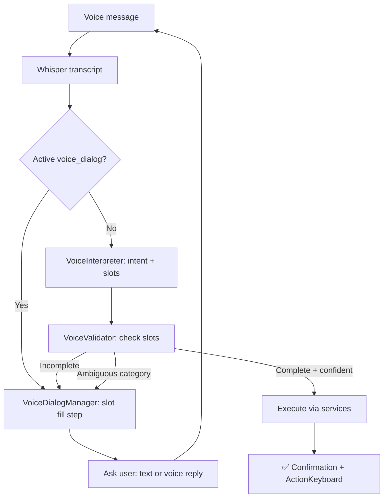

# Voice Assistant v2 — план

**Status:** planning  
**Branch:** `feature/voice-assistant-v2`  
**Цель:** голосовой помощник понимает контекст, уточняет неполные/некорректные запросы и доводит до корректной записи в БД.

---

## 1. Диагноз: почему «работает криво»

### Что есть сейчас (MVP)

```
Voice → Whisper → [regex | LLM JSON] → VoiceRouter → CommandExecutor → DB
```

| Компонент | Реальность |
|-----------|------------|
| `CREATE_TRANSACTION` | Работает частично |
| `SET_BUDGET` | ✅ Phase 3 — create/update monthly expense budget |
| `MANAGE_GOAL` | **Stub** |
| `ASK_ADVISOR` | ✅ MVP — snapshot + grounded LLM answer |
| Уточнения | Только бинарное «✅ Да / ❌ Отмена» при confidence 0.5–0.85 |
| Диалог | **Нет** — один проход, нет дозаполнения слотов |
| Категории | Строковый match (`_find_category`), без disambiguation |
| Несуществующая категория | Клавиатура всех категорий + «не найдена» — без «создать?» / «имели в виду?» |

### Критические баги (P0)

1. **`description` теряется** — LLM извлекает, `to_executor_dict()` не передаёт в `TransactionService`.
2. **Goals через голос в wizard сломан** — `voice_handler` считает `goal_*` interactive, но `_handle_goal_creation_input` читает `update.message.text`, а не `_voice_text_override`.
3. **`UserState.awaiting_category` не в bypass** — голос во время выбора категории после «500» парсится как новая команда.
4. **`amount_only` всегда confirm** — fast path confidence=1.0, но без категории → лишний шаг подтверждения.
5. **Income natural phrases** — `NATURAL_VOICE_RE` только expense-глаголы («добавь», «потрать»), нет «получил зарплату».
6. **Нет паритета с текстом** — alias (`п500`), `category_only` не в voice fast path.
7. **`voice_pending` перезаписывается** — новое голосовое затирает незавершённое подтверждение.

### Архитектурный разрыв

Текстовый бот = **state machine** (`UserState` + `context.user_data` + многошаговые wizard'ы).  
Голосовой бот = **one-shot parser** (распознал → выполнил / отклонил).  

Отсюда «кривость»: голос не умеет вести диалог, который текстовый бот уже умеет.

---

## 2. Целевое поведение

### Принципы

1. **Слоты, не одна JSON-команда** — intent + обязательные поля (amount, category, period…).
2. **Уточнять, а не падать** — неполный запрос → конкретный вопрос, не «не понял».
3. **Подтверждать только рискованное** — auto-save при высокой уверенности + resolved category; confirm при неоднозначности.
4. **Паритет с текстом** — те же бизнес-правила через `services/`, не дублировать ORM в voice/.
5. **Прозрачность** — всегда показывать `🎤 Распознано: «…»` + что именно будет записано.

### Целевой pipeline



---

## 3. Матрица сценариев

### 3.1 Расходы (CREATE_TRANSACTION / expense)

| # | Пользователь говорит | Ожидание | Сейчас | Проблема |
|---|---------------------|----------|--------|----------|
| E1 | «500 продукты» | Auto-save expense → Продукты | ✅ regex fast path | — |
| E2 | «добавь 500 рублей на продукты» | Auto-save | ✅ compact natural | — |
| E3 | «потратил триста на еду» | LLM → продукты/еда | ⚠️ LLM only | Нет spoken numbers в regex |
| E4 | «500» | Выбор категории (без confirm) | ⚠️ confirm + keyboard | Лишний confirm |
| E5 | «500 абракадабра» | «Категория не найдена. Выбери или уточни» | ⚠️ full keyboard | Нет «имели в виду X?» |
| E6 | «500 кофе» (категория «Кафе») | Match через synonym | ⚠️ depends on DB name | Synonym map привязан к имени в БД |
| E7 | «500 еда и транспорт» | «Одна операция — одна категория. Уточни.» | ❌ | Может сохранить неверно |
| E8 | «минус 500 продукты» | Expense 500 | ✅ | — |
| E9 | Повтор E1 дважды | Вторая — без ошибки | ✅ после safe_edit fix | — |
| E10 | Голос во время `awaiting_category` | Дополняет текущий flow | ❌ | Новый parse вместо picker |

**Факапы E:**
- Whisper: «пятьсот» → «500» / «5 00» / пусто
- Категория expense названа как income-слово → wrong type
- Partial match: «маг» → «Магазин» или «Магнит»? → нужен disambiguation
- amount=0 / отрицательный / 999999999 → validation error
- Дубликат транзакции за секунду (double voice) → идемпотентность?

### 3.2 Доходы (CREATE_TRANSACTION / income)

| # | Пользователь говорит | Ожидание | Сейчас | Проблема |
|---|---------------------|----------|--------|----------|
| I1 | «+5000 зарплата» | Auto-save income | ✅ regex `+` | — |
| I2 | «получил зарплату 50 тысяч» | income → Зарплата | ❌ | Нет income natural regex |
| I3 | «доход 3000 подработка» | income | ⚠️ LLM | Зависит от confidence |
| I4 | «500 зарплата» без `+` | income (по слову) | ⚠️ `_determine_transaction_type` | Может стать expense |
| I5 | «зарплата» без суммы | «Какую сумму?» | ❌ reject | Нет slot-fill |
| I6 | Income в expense-категорию | Уточнить тип | ❌ | Сохранит как expense |

**Факапы I:**
- «50 тысяч» / «полтора миллиона» — нужен number normalizer
- Зарплата в категории «Подарки» — semantic mismatch → confirm

### 3.3 Бюджеты (SET_BUDGET)

| # | Пользователь говорит | Ожидание | Сейчас |
|---|---------------------|----------|--------|
| B1 | «лимит 5000 на продукты» | Budget monthly → Продукты | ✅ Phase 3 |
| B2 | «бюджет 10 тысяч еда» | То же | ✅ Phase 3 (LLM / synonym) |
| B3 | «установи лимит на транспорт» (без суммы) | «Какой лимит?» | ✅ Phase 3 dialog |
| B4 | «лимит 5000» (без категории) | «На какую категорию?» | ✅ Phase 3 dialog |
| B5 | Категория без бюджетов / duplicate budget | Update vs create — уточнить | ✅ Phase 3 confirm |
| B6 | Голос в `waiting_for_budget_amount` | Сумма в wizard | ⚠️ works via override | OK |

**Факапы B:**
- Бюджет ≠ лимит в UI (два flow: `budget_handler` vs `limit_creation`) — voice должен знать оба или унифицировать
- Категория income — бюджет обычно только expense
- Существующий бюджет → «обновить с X на Y?»

### 3.4 Лимиты (часть settings / SET_BUDGET alias)

| # | Сценарий | Ожидание | Сейчас |
|---|----------|----------|--------|
| L1 | «лимит 3000 кофе» в settings flow | `Budget.objects.create` monthly | ✅ Phase 3 SET_BUDGET |
| L2 | Голос в `limit_creation` step | Принять сумму | ⚠️ override works | OK |
| L3 | Лимит на несуществующую категорию | Уточнение | ❌ |

### 3.5 Цели (MANAGE_GOAL)

| # | Сценарий | Ожидание | Сейчас |
|---|----------|----------|--------|
| G1 | «пополни цель отпуск на 5000» | deposit | ✅ Phase 4 |
| G2 | «создай цель iPad 100000» | wizard shortcut | ✅ Phase 4 create |
| G3 | Голос в goal_creation_step | title/amount/deadline | ✅ Phase 0 |
| G4 | Голос deposit/withdraw prompt | amount | ✅ Phase 0 |
| G5 | Цель «отпуск» не найдена | список целей / уточнить | ✅ Phase 4 picker |

### 3.6 Несуществующая категория (сквозной сценарий)

**Текущий flow:**
```
category_name от LLM → _find_category → None → send_category_selection(prefix="не найдена")
```

**Проблемы:**
- LLM может вернуть имя **не из списка** (нарушение prompt) → всё равно не найдётся
- Нет fuzzy match → «мобильный» vs «Мобильная связь»
- Нет top-3 suggestions → пользователь видит всю клавиатуру
- Нет «Создать категорию "X"?»
- Нет повторного голосового уточнения в рамках `voice_dialog`

**Целевой flow:**
```
unknown category
  → CategoryResolver.suggest(name) → [exact, fuzzy matches]
  → if 1 match ≥ threshold: «Имели в виду 📱 Мобильная связь?» [Да] [Нет, другая]
  → if N matches: inline keyboard top-3 + «Все категории»
  → if 0 matches: «Категория "X" не найдена. Создать?» [Создать expense] [Выбрать из списка]
  → voice/text ответ продолжает voice_dialog
```

### 3.7 Контекст и прерывания

| # | Ситуация | Ожидание | Сейчас |
|---|----------|----------|--------|
| X1 | Голос во время voice_pending confirm | «Сначала подтверди предыдущую» или merge | ❌ overwrite |
| X2 | Голос во время editing_transaction | Сумма/дата/коммент | ✅ override | OK |
| X3 | Голос во время rename category | Новое имя | ✅ | OK |
| X4 | /start во время voice_dialog | Сброс dialog | ❌ |
| X5 | Два голосовых подряд быстро | Очередь или cancel previous | ❌ race |
| X6 | Interactive menu + свободный голос | Приоритет interactive | ⚠️ partial | goals broken |

### 3.8 Технические факапы

| # | Факап | Impact | Mitigation |
|---|-------|--------|------------|
| T1 | OPENAI_API_KEY missing | Transcribe/LLM fail | Graceful msg + text fallback |
| T2 | Whisper timeout / region | No transcript | Retry + proxy hint (есть) |
| T3 | LLM JSON invalid | Parse fail | Retry 3x (есть) + fallback regex |
| T4 | LLM hallucination category | Wrong save | Confirm threshold + resolver |
| T5 | confidence всегда 0.9 от LLM | Auto-save errors | Calibrate + validator independent of LLM confidence |
| T6 | Long audio >20MB | ValueError | Chunking (есть) |
| T7 | Admin alert on unhandled | Noise | Separate voice error handler |
| T8 | Cost: каждый voice = Whisper+LLM | $$$ | Expand regex fast path |

---

## 4. Что нужно для реализации

### 4.1 Новые модули

| Модуль | Назначение |
|--------|------------|
| `voice/dialog.py` | `VoiceDialogState`, `VoiceDialogManager` — multi-turn slot filling |
| `voice/validator.py` | Проверка слотов по intent, независимо от LLM confidence |
| `voice/category_resolver.py` | Fuzzy match, suggestions, create-offer |
| `services/voice_budget_executor.py` | SET_BUDGET → Budget create/update (reuse budget_handler logic) |
| `services/voice_goal_executor.py` | MANAGE_GOAL → goals service |
| `voice/number_words.py` | «триста», «50 тысяч» → Decimal (regex + optional LLM) |

### 4.2 Расширение существующих

| Файл | Изменения |
|------|-----------|
| `intents.py` | `ParsedVoiceCommand` + slots: `budget_period`, `goal_id`, `goal_action`, `clarification_needed`, `missing_slots[]` |
| `interpreter.py` | Income natural regex; alias fast path; LLM schema + `missing_slots`, `clarification_question` |
| `prompts/voice_command.txt` | Правила уточнения; «не выдумывай категории»; budget/goal slots |
| `router.py` | Route to dialog manager; implement SET_BUDGET, MANAGE_GOAL |
| `command_executor.py` | `description`; `execute_set_budget`; disambiguation UI |
| `voice_handler.py` | Check `voice_dialog` before interpret; expand interactive keys |
| `text_handler.py` | Goal handlers: `message_text` param; voice_dialog text replies |
| `callback_handler.py` | `voice_pick_category_*`, `voice_confirm_category_*`, `voice_create_category_*` |

### 4.3 `context.user_data` keys (новые)

```python
voice_dialog = {
    'intent': 'create_transaction',
    'step': 'awaiting_category',      # awaiting_amount | awaiting_confirm | ...
    'slots': {'amount': 500, 'transaction_type': 'expense'},
    'transcript': '...',
    'suggestions': [category_id, ...],
    'created_at': timestamp,
}
```

`voice_pending` — оставить для финального confirm, но не перезаписывать без предупреждения.

### 4.4 LLM schema v2 (дополнительные поля)

```json
{
  "intent": "...",
  "amount": 500,
  "category_name": "продукты",
  "transaction_type": "expense",
  "confidence": 0.92,
  "missing_slots": ["category_name"],
  "clarification_question": "На какую категорию записать 500₽?",
  "category_candidates": ["Продукты", "Еда"],
  "description": "..."
}
```

### 4.5 CategoryResolver — алгоритм

1. Exact match (case-insensitive)
2. Synonym map (расширить: user categories + default templates)
3. Fuzzy: `difflib.SequenceMatcher` или `rapidfuzz` (опционально dep)
4. Return: `{match: Category|None, candidates: [(Category, score)], confidence}`

Порог auto-pick: score ≥ 0.85 и отрыв от 2-го ≥ 0.15.

### 4.6 Env / infra

Без новых обязательных env. Опционально:
- `VOICE_DIALOG_TIMEOUT_SEC` (default 300) — сброс незавершённого диалога
- `VOICE_FUZZY_THRESHOLD` — tuning resolver

---

## 5. Фазы реализации

### Phase 0 — Bugfix baseline (1–2 дня)

**Цель:** починить то, что сломано, без новой архитектуры.

- [x] `description` через `to_executor_dict()` → `create_transaction`
- [x] Goal handlers: `message_text` вместо `update.message.text`
- [x] `UserState.awaiting_category` / `awaiting_category_creation` в interactive bypass
- [x] Income `NATURAL_VOICE_RE` (+ «получил», «заработал», «доход»)
- [x] `amount_only` fast path: skip confirm → сразу category picker
- [x] `voice_pending` guard: не перезаписывать без отмены
- [x] Тесты на регрессии

**PR:** #30 — `feature/voice-phase-0-bugfix` (merged)

**Критерий готовности:** E1–E4, I1–I2, G3–G4, B6, L2 работают стабильно.

### Phase 1 — Category intelligence (2–3 дня)

**Цель:** несуществующая/неоднозначная категория → умное уточнение.

- [x] `CategoryResolver` service
- [x] Disambiguation UI (top-3 + «все категории»)
- [x] «Имели в виду …?» confirm callback (`voice_cat_pick_*`)
- [x] Offer create category (reuse `awaiting_category_creation` + auto tx)
- [x] Расширить synonym map (default templates + legacy)
- [x] Тесты: exact, fuzzy, unknown, ambiguous

**PR:** `feature/voice-phase-1-category-intelligence`

**Критерий:** E5, E6, сценарий §3.6 закрыт.

### Phase 2 — Voice dialog manager (3–4 дня)

**Цель:** multi-turn уточнения.

- [x] `VoiceDialogManager` + `voice_dialog` state
- [x] Steps: `awaiting_amount`, `awaiting_category`, `awaiting_type`, `awaiting_confirm`
- [x] Голос/text ответ продолжает dialog (не новый interpret с нуля)
- [x] Конкретные вопросы вместо generic error
- [x] Timeout / cancel (`voice_cancel` сбрасывает dialog)
- [x] X1, X4, X5 handling (pending block + dialog priority + timeout)

**PR:** `feature/voice-phase-2-dialog-manager`

**Критерий:** I5, B3, B4, «500» → picker без лишних шагов, уточнение голосом.

### Phase 3 — Budget & limits voice (2 дня)

**Цель:** SET_BUDGET реально работает.

- [x] `VoiceBudgetExecutor` — create/update monthly budget
- [x] Router: убрать stub SET_BUDGET
- [x] Slot validation: amount + category required
- [x] Confirm при update existing budget
- [x] Унификация «бюджет» vs «лимит» в одном intent (или alias)
- [x] Тесты B1–B5, L1

**PR:** `feature/voice-phase-3-budget`

**Критерий:** B1–B5, confirm на update, expense-only.

### Phase 4 — Goals voice (2 дня)

**Цель:** MANAGE_GOAL.

- [x] `VoiceGoalExecutor`: deposit, withdraw, create (simple)
- [x] Match goal by title (fuzzy)
- [x] Router: убрать stub MANAGE_GOAL
- [x] G1, G2, G5

**PR:** `feature/voice-phase-4-goals`

**Критерий:** deposit/withdraw/create + goal picker.

### Phase 5 — Hardening (ongoing)

- [x] Spoken numbers (`number_words.py`)
- [x] Metrics: transcribe_ms, llm_ms, auto_save / clarification route events
- [x] E2E-ish unit tests (spoken numbers + unknown category slots; no live OpenAI)
- [x] Prompt tuning per-user categories (Whisper prompt via `whisper_context.py`)
- [x] ASK_ADVISOR — MVP (snapshot + grounded LLM; отдельный эпик расширений остаётся)

**PR:** `feature/voice-phase-5-hardening`

**Критерий:** «пятьсот продукты» → regex; metrics в логах; Whisper bias по категориям.

---

## 6. Тест-стратегия

### Unit

| Area | Tests |
|------|-------|
| `CategoryResolver` | exact, synonym, fuzzy, no match, ambiguous |
| `VoiceValidator` | missing slots per intent |
| `VoiceDialogManager` | step transitions, timeout, cancel |
| `number_words` | «триста», «50 тысяч», «1.5 млн» |
| `interpreter` | income natural, alias, LLM payload edge cases |

### Integration (mock OpenAI)

| Flow | Assert |
|------|--------|
| E1 auto-save | Transaction in DB |
| E5 unknown cat | dialog step + keyboard |
| B1 set budget | Budget in DB |
| G1 deposit | GoalLedgerEntry |
| voice_pending | no overwrite |

### Manual checklist (prod smoke)

- [ ] Расход: чёткая фраза → auto-save
- [ ] Расход: без категории → уточнение
- [ ] Доход: «получил зарплату N»
- [ ] Несуществующая категория → suggestions
- [ ] Бюджет голосом
- [ ] Лимит голосом (в wizard)
- [ ] Цель: пополнение голосом
- [ ] Отмена на любом шаге
- [ ] Двойной клик / повтор голоса

---

## 7. Не входит в v2 (non-goals)

- ASK_ADVISOR extensions (trends, arbitrary periods) — backlog after MVP
- Multi-transaction в одной фразе
- Edit/delete транзакций голосом
- Local Whisper
- Голосовой ввод даты транзакции
- Document upload filter (`.ogg` file)

---

## 8. Риски

| Риск | Вероятность | Митигация |
|------|-------------|-----------|
| LLM overconfidence | Высокая | Validator независим от confidence |
| Рост latency (dialog turns) | Средняя | Fast path + короткие вопросы |
| Сложность state machine | Средняя | Один `VoiceDialogManager`, не размазывать |
| Бюджет vs лимит путаница | Высокая | Единый intent SET_BUDGET + docs |
| Regression text flow | Средняя | Shared executors, не трогать text parse |

---

## 9. Рекомендуемый порядок работ в ветке

```
Phase 0 (bugfix) → PR #1 — можно деплоить сразу
Phase 1 (categories) → PR #2
Phase 2 (dialog) → PR #3
Phase 3 (budget) → PR #4
Phase 4 (goals) → PR #5
```

Каждая фаза — рабочее состояние + тесты + обновление этого чеклиста.

---

## 10. Связанные файлы (reference)

| Path | Role |
|------|------|
| `handlers/voice_handler.py` | Entry |
| `voice/interpreter.py` | Parse |
| `voice/router.py` | Route |
| `voice/intents.py` | Model |
| `services/command_executor.py` | Execute tx |
| `utils/text_parser.py` | Category match |
| `prompts/voice_command.txt` | LLM prompt |
| `handlers/text_handler.py` | Interactive states |
| `handlers/budget_handler.py` | Budget wizard |
| `handlers/settings_handler.py` | Limits wizard |
